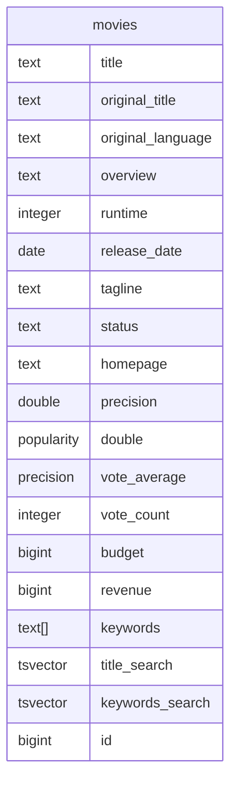

# sqlxgen

[](https://github.com/mvoorberg/sqlxgen/actions/workflows/test.yml) 
[](https://github.com/mvoorberg/sqlxgen/actions/workflows/release.yml) 
[](https://raw.githubusercontent.com/mvoorberg/sqlxgen/main/LICENSE.md)

`sqlxgen` is a command line tool to generate easy-to-use models and 
a generic sqlx based repository to interact with your existing database schema. Get more done with less code and when you need to write custom code, the generated stuff gets out of your way to let you get the job done!

1. Initialize your project with the `sqlxgen init` command to create a `sqlxgen.yml` file that can be configured to load some or all of the tables in your database, and write models to folders specific to your project.
1. Running `sqlxgen generate --config=sqlxgen.yml` will inspect the objects within your your [postgres](https://github.com/mvoorberg/sqlxgen/blob/main/internal/introspect/pg/model.sql) or [mysql](https://github.com/mvoorberg/sqlxgen/blob/main/internal/introspect/mysql/model.sql) database to generate accurate model code.
1. Each time you make changes to the structure of your database, re-run the above `generate` command to create updated models.
1. Get down to the business of writing your application with less custom code and fewer bugs!

## Installation
### homebrew
```bash
brew install mvoorberg/tap/sqlxgen
```

### Releases
checkout releases [here](https://github.com/mvoorberg/sqlxgen/releases)

### Install from source
```bash
go install -v github.com/mvoorberg/sqlxgen/cmd/sqlxgen@latest
```

## Usage

1. generate `sqlxgen.yml` file in your project root directory with the following command.
```bash
sqlxgen init
```
2. Edit `sqlxgen.yml` file to suit your needs. [example](example/sqlxgen.yml#L12-L14)
   1. `host` takes precedence over `url`.
   2. with `host` other parameters can be omitted.
   3. just provide `url` if you want to use it as is.
   4. default connection for postgres is `postgres://postgres:@localhost:5432/postgres?sslmode=disable`
   5. default connection for mysql is `root:@tcp(localhost:3306)/mysql?parseTime=true`

```yaml
# expand env vars, host takes precedence over url
# url: postgres://u:p@h:5432/db?sslmode=disable
# host: h1
# result: postgres://postgres:@h1:5432/db?sslmode=disable
```
3. Generate table and query model code with the following command. By default it will use `sqlxgen.yml` and `.env` files from the current directory.
```bash
sqlxgen generate [--config <path-to-config-file>]
```

## Example
A fully generated [example](example) is included with the source of this project.

The following movies table generates [movies.gen.go](example/internal/tmdb_pg/models/movie.gen.go)

The following query, saved in a file named `get_actor.sql` generates the model file "[get_actor.gen.go](example/internal/tmdb_pg/api/get_actor.gen.go)". Note that the query parameter is decorated with `-- :id type: bigint` to tell the code generation how to handle the query parameter.
```sql
select
a."id" as "id",
a."name" as "name",
coalesce(
  (
    select
    jsonb_agg(
      jsonb_build_object(
        'id', ma.movie_id,
        'title', m.title,
        'releaseDate', m.release_date,
        'character', ma.character
      ) order by m.release_date desc
    )
    from movies_actors ma
    inner join movies m on ma.movie_id = m.id
    where true
    and ma.actor_id = a.id
  ),
  '[]'
) as "movies"
from actors a
where a.id = :id; -- :id type: bigint
```

## Issues
1. ...not yet implemented

## Motivation
1. Many of the projects I work on already have a database, so a database-first approach makes so much sense.
2. I don't want to hand-write model objects to match tables that already exist. It's tedious and error prone. Let the computer do that work.
3. Simple CRUD functions don't need to be written by hand, it's the same functions repeated throughout any codebase. Using a generic API that knows how to execute CRUD functions with generated models can greatly reduce the amount of code you need to write.
4. [Sqlx named queries](https://github.com/jmoiron/sqlx) do an amazing job mapping query results to generated models and from models to query parameters.

## Contributing
Find a bug or have suggestions that could improve the generated code? Let me know or submit a PR.

## License
[MIT](LICENSE.md)

## Feedback
Please feel free to [open an issue](https://github.com/mvoorberg/sqlxgen/issues/new) if you have any feedback or suggestions.

## Acknowledgements
This project was initially developed by [Aakash Rajur](https://github.com/aakash-rajur). He's done some amazing work on it and I learned a lot by going through it. We have different ideas about what the generated API should be so I'm publishing from my fork.
1. [Aakash Rajur](https://github.com/aakash-rajur/sqlxgen)
2. [TMDB](https://www.kaggle.com/datasets/tmdb/tmdb-movie-metadata)
3. [sqlx](https://github.com/jmoiron/sqlx)

